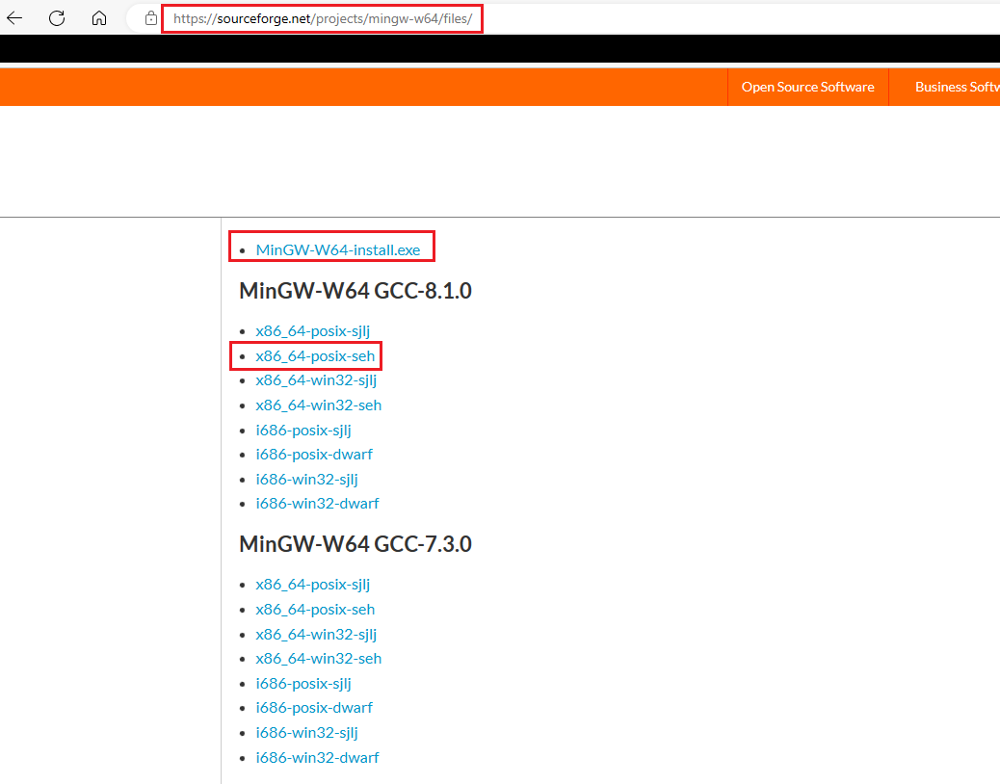

## 链接
1. [pylink官方文档](https://pylink.readthedocs.io/en/latest/index.html)
2. [pylink博客](https://blog.csdn.net/qq_29506411/article/details/128028590?spm=1001.2014.3001.5501)
3. 在安装[JLink-tools](https://www.segger.com/downloads/jlink/)的路径下可以获取到开发过程中需要使用的`JLink_x64.dll`和`JLinkARM.dll`库文件;
4. [UM08002](https://www.scribd.com/document/447972596/UM08002-JLinkDLL-pdf);
5. [python-JLINK博客](https://www.linmingjie.cn/index.php/archives/108/)

## 问题及措施步骤
1. 目标：想要一个能带时间戳的RTT日志输出
2. 找到了一个现成工具：[RTT-T](https://gitee.com/bds123/RTT-T)，但是在切换通道的时候发现总是多一个`'ÿ'`字符；
3. 于是根据`RTT-T`项目，发现其使用了[pylink-doc](https://pylink.readthedocs.io/en/latest/), [pylink-source](https://github.com/square/pylink/tree/master)这个库；
4. 而根据pylink库的example，可以直接接收RTT日志，但依旧还有`'ÿ'`字符;
5. 又从`pyink`的文档中了解到，这个`pylink`只是通过`python`调用了`JLink_x64.dll`这个`C`库文件，而我对`python`不熟，搞了半天没成功去掉这个多余的字符；
6. 于是打算直接用`C`语言调用`JLink_x64.dll`文件；
7. 但是通过`C`语言的`LoadLibrary()`函数加载库文件时，一直出错，原来是`32`位的程序只能加载`32`位的库，`64`的程序才能加载`64`位的库；而`JLink_x64.dll`和`JLinkARM.dll`这两个库的区别就是前者是`64`位的，后者是`32`位的库。
8. 本来通过32位的库也是一样可以用的，但是我还是想知道64位库要如何调用，然后发现需要更新MinGW，原来我的编译器版本太低了，只支持32位。
9. 然后下载[MinGW-w64](https://sourceforge.net/projects/mingw-w64/)打算安装，却发现没有安装器不知道如何安装，折腾了老久才发现在这个页面的[Files](https://sourceforge.net/projects/mingw-w64/files/)下面，有一个[MinGW-W64-install.exe](https://sourceforge.net/projects/mingw-w64/files/Toolchains%20targetting%20Win32/Personal%20Builds/mingw-builds/installer/mingw-w64-install.exe)，本以为一切要大功告成了，但我还是高兴早了，这个在线安装器安装失败，说下载不正确。。。最终发现，在安装器下面还有一个链接[x86_64-posix-seh](https://sourceforge.net/projects/mingw-w64/files/Toolchains%20targetting%20Win64/Personal%20Builds/mingw-builds/8.1.0/threads-posix/seh/x86_64-8.1.0-release-posix-seh-rt_v6-rev0.7z)，我只需要把这个下载并解压到安装路径，然后添加一下系统路径就可以了！

10. 现在终于可以在C语言中导入JLink_x64.dll这个库，并使用其中的内容了，但是这个DLL中具体有什么API可以使用呢？其中又有什么宏定义呢？请参考[JLinkSDK header](https://github.com/dihonglongxi/FactoryTestApp/tree/master/JLinkSDK)以及`UM08002`；
11. 现在的问题就是如何利用这个DLL库文件实现需求？
12. 由于在DLL库中一直没找到如何设置MCU，最终还是在上面链接2的基础上完善了一下功能。
13. 目前的[pylink-rtt.py](./pylink-rtt.py)文件不仅可以给RTT日志加时间戳，还能将不同的RTT终端日志打印到不同的文件中。
14. 生产的日志文件中，如果不需要时间戳可以通过正则表达式`\[[0-9 :.]{21}\] `匹配删除。

## 说明
1. pylink的官方文档，以及其GitHub上的源码及例程，可以直接运行pylink-rtt用于RTT日志的收发；
2. 导入`pylink`的`python`文件一定要和`JLink_x64.dll`（或者是`JLinkARM.dll`在同一路径下），不然找不到这个库文件会导致`pylink`在调用`JLink`的`API`时出错；
3. 以下是一些接口的功能说明：
```python
import pylink                       # 导入 pylink 模块

jlink = pylink.JLink()              # 创建对象

print("before open:")
print("    opened:          ", jlink.opened())            # opened() 用于判断JLink仿真器是否打开
print("    connected:       ", jlink.connected())         # connected() 用于判断JLink仿真器是否连接，和opened()区别是什么呢？
print("    target_connected:", jlink.target_connected())  # target_connected() 用于判断仿真器是否和MCU连接

print("\n*** OPEN ***\n")
jlink.open(serial_no=25952323)  # get the serial_no by command "showEmuList" in "J-Link Commander"

print("after open:")
print("    opened:          ", jlink.opened())            # open() 后，从 False 变成了 True
print("    connected:       ", jlink.connected())         # open() 后，从 False 变成了 True
print("    target_connected:", jlink.target_connected())  # open() 后，这个依然是 False

print("\nproduct_name:", jlink.product_name)              # SEGGER J-Link ARM
print("OEM:         ", jlink.oem)                         # None

print("\n*** CONNECT ***\n")
jlink.connect('STM32H743II')

print("after connect MCU:")
print("    opened:          ", jlink.opened())            # 保持 True
print("    connected:       ", jlink.connected())         # 保持 True
print("    target_connected:", jlink.target_connected())  # connect() 后，从 False 变成了 True

print("\ncore_id:    ", jlink.core_id())          # 把这个值转换成十六进制，就是在MDK中连接JLink时看到的这个值了
print("device_family:", jlink.device_family())
```

